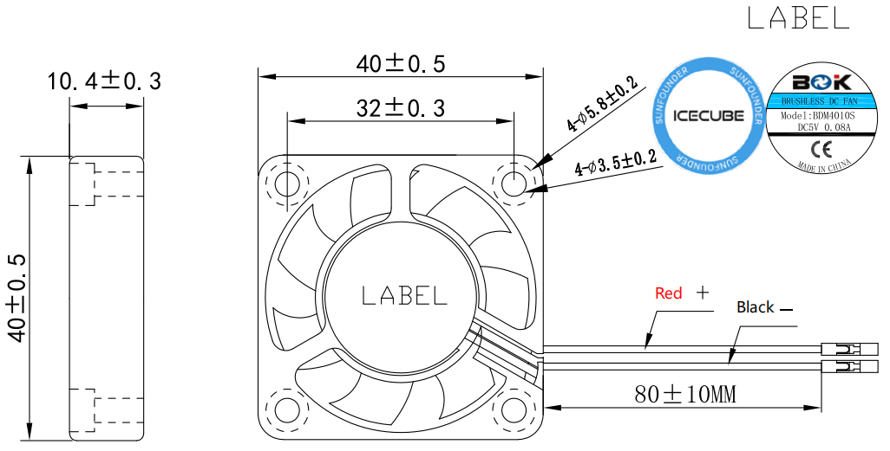

RGB Fan
============

* **Extermal dimension**: 40*40*10MM
* **Weight**: 13.5±5g/pcs
* **Life**: 40,000 hours (room temperature 25°C)
* **Maximum Air Flow**: 2.46CFM
* **Max.Air Pressure**: 0.62mm-H2O
* **Accoustic Sound**: 22.31dBA
* **Rated Input power**: 5V/0.1A
* **Rated Speed**: 3500±10%RPM
* **Operating Temperature**: -10℃~+70℃
* **Storage Temperature**: -30℃~+85℃