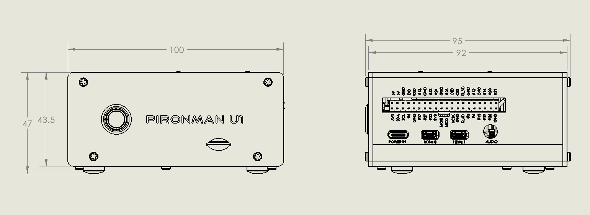

.. note::

    Hello, welcome to the SunFounder Raspberry Pi & Arduino & ESP32 Enthusiasts Community on Facebook! Dive deeper into Raspberry Pi, Arduino, and ESP32 with fellow enthusiasts.

    **Why Join?**

    - **Expert Support**: Solve post-sale issues and technical challenges with help from our community and team.
    - **Learn & Share**: Exchange tips and tutorials to enhance your skills.
    - **Exclusive Previews**: Get early access to new product announcements and sneak peeks.
    - **Special Discounts**: Enjoy exclusive discounts on our newest products.
    - **Festive Promotions and Giveaways**: Take part in giveaways and holiday promotions.

    👉 Ready to explore and create with us? Click [|link_sf_facebook|] and join today!

Features
======================

**Functions**

* Raspberry Pi 5/4 Model B UPS Case
* Hardware power path switching to ensure power supply to the Raspberry Pi
* Equipped with 3 current sensors to measure: USB input current, Raspberry Pi current, and battery charge/discharge current.
* Intelligent adjustment of charging current
* I2C communication to read battery voltage, current, and other information
* PCIe 3.0 x1 M.2 M key 2230, 2242, 2260, 2280 for NVMe SSD
* IR Receiver for multimedia centers like Kodi or Volumio
* Comes with a fan controlled by Raspberry Pi via I2C to MCU
* Retro metal power button with indicator light for safe shutdown
* Extend the 40-pin GPIO outward with pin name label, for easy access
* Direct Access to Raspberry Pi's microSD Card Slot
* Aluminum main body with a black Acrylic side panel

**Parameters**

* Dimension: 100x95x47mm
* Material
    * Main body: aluminum alloy
    * Two side panel: acrylic
* Support Platform: Raspberry Pi 5B/4B
* Power Input: USB Type C input, 5V/5A, supports PD protocol. It is recommended to use the official 27W power supply of Raspberry Pi or other Pi5 dedicated USB PD protocol 5V/5A power sources.
* Power supply to Raspberry Pi: 5V/5.5A
* Charging Power: 7.4V/1A
* Interfaces
    * Raspberry Pi standard 40-Pin GPIO
    * micro SD
    * USB Type C power input
    * 2 x USB 2.0
    * 2 x USB 3.0
    * Gigabit LAN port
    * 2 x 4Kp60 HDMI Type A
* 1 x Fan: 40x40x10mm
* 38KHz IR Receiver
* PCIe 3.0 x1 M.2 M key 2230, 2242, 2260, 2280 for NVMe SSD
* A CR1220 non-rechargeable battery for RTC
* RGB LED Metal Power Button

**Dimensional Drawing**

