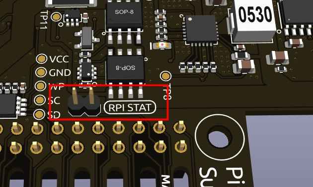
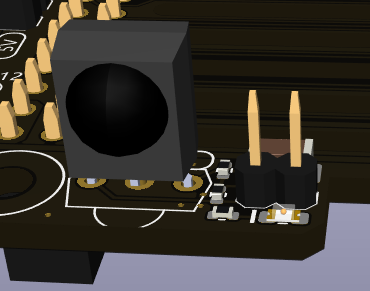
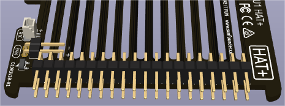

Main Board
================

Power Supply
----------------

**Power Input**

USB Type C input, 5V/5A, PD protocol. It's recommended to use the official 27W power supply of Raspberry Pi or other Pi5 dedicated USB PD protocol 5V/5A power sources.

**Battery**

Equipped with a custom battery pack made by SunFounder, consisting of two 18650 batteries with a capacity of 2000mAh. The connector is XH2.54, 3P, which can be directly charged after being inserted into the board.

The battery includes a built-in protection circuit, with an over-discharge protection voltage of 2.6V and an over-charge protection voltage of 4.2V.

**Power Path**

The Pironman U1 features an integrated power path function, which can automatically switch power paths to reduce battery wear and ensure uninterrupted power supply to the Raspberry Pi.

* When an external USB power source is connected, it directly supplies power to the Raspberry Pi and can also charge the battery if needed.
* If external power is lost, the system automatically switches to battery power, ensuring uninterrupted operation.
* If external power voltage drops below 4.72V, the system automatically switches to battery power to prevent low voltage issues in the Raspberry Pi.

**Advantage**: Normally powered by an external USB power source, extending the lithium battery's lifespan. In critical moments, it timely switches to battery power to ensure the safety of the Raspberry Pi.

**Charging Current**

Capable of intelligently adjusting the charging current. When the input current from the external USB power source is sufficient, the charging current for the battery is increased, up to a maximum of 7.4V/1A. When the Raspberry Pi requires more current, or the input current is insufficient, the charging current is automatically reduced.

**Overcharge Protection**

Charging ends when the total battery voltage reaches 8.4V. Charging resumes when the battery voltage drops below 8V.

**Charge Balancing**

During charging, the voltage of each of the two batteries is continuously monitored. If the voltage of any one battery reaches the balance initiation voltage of 4.1V, the corresponding balance MOS is activated to reduce the charging current of that battery. 

Balance is turned off under the following conditions:

* The voltage of both batteries exceeds the balance initiation voltage of 4.1V.
* Exiting normal charging state (input overvoltage, battery full, etc.).

Power-On Startup
--------------------

The module supports power-on startup, initiating as soon as the external power source is plugged in.
To disable automatic power-on, remove the **ALWAYS ON** jumper cap. This requires manually pressing the power button to start the Raspberry Pi, even when an external power source is connected or after a power outage.

Raspberry Pi Status Monitoring
---------------------------------------

To turn off the Pironman U1, you need to press and hold the power button for 2 seconds until the button light turns purple, then release. 

At this point, Pironman U1 will send a shutdown signal to the Raspberry Pi via I2C. If you have followed the :ref:`install_spc` instructions, the Raspberry Pi will then proceed with a safe shutdown. 

After shutdown, the configured Raspberry Pi shutdown signal pin, GPIO26, will go low. Once Pironman U1 detects this low signal, it cuts off the power to the Raspberry Pi.

In the ``spc`` program, the shutdown signal pin is set by adding the following line to the Raspberry Pi's ``/boot/config.txt`` file.

.. code-block:: shell

  dtoverlay=gpio-poweroff,gpio_pin=26,active_low=0

The **RPI STAT** jumper cap connects the microcontroller's shutdown signal with the Raspberry Pi's GPIO26. You can also remove this jumper cap to free up GPIO26. However, doing so means you won't be able to perform a safe shutdown of the Raspberry Pi.

Infrared Receiver
---------------------------

* **Model**: IRM-56384, operating at 38KHz.
* Two pins for enabling the infrared function. By default, a jumper cap is inserted for immediate functionality. Remove the cap to free GPIO13 if the IR receiver is not in use.
* An infrared reception indicator that blinks upon signal detection.

To utilize the IR receiver, verify its connection and install the necessary module:

* Test the connection:

  .. code-block:: shell

    sudo ls /dev |grep lirc

* Install the ``lirc`` module:

  .. code-block:: shell

    sudo apt-get install lirc -y

* Now, test the IR Receiver by running the following command. After running the command, press a button on the remote control, and the code of that button will be printed.

  .. code-block:: shell

    mode2 -d /dev/lirc0
  

Fans Pin
-------------

Fan Pin, for connecting a 4010 fan.

* You can set the fan's operation mode via command: ``auto``, ``quiet``, ``normal``, ``performance``.

  .. code-block:: shell

    spc -F auto

* Alternatively, you can directly set the fan speed, ranging from 0% to 100%.

  .. code-block:: shell

    spc -f 40

* You can use them without parameters to get the current data. For example, use the command below to get the current fan speed.

    .. code-block:: shell

      spc -f

RTC Function
---------------
The onboard microcontroller supports the RTC (Real-Time Clock) function. Install a button cell battery in the onboard 1220 battery holder, and connect the **jumper cap (RTCEN)** on the battery holder (by default, it is connected) to use the microcontroller's RTC function.

**For Raspberry Pi 4**

When the Pironman U1 is powered off or shut down, the microcontroller is powered by the button cell battery, recording the time, with a standby current of about 2uA. The board does not support charging the RTC battery, so there is no need to use a rechargeable battery. A **CR1220** battery is recommended.

If you have followed the :ref:`install_spc` instructions, the Raspberry Pi will automatically synchronize with the RTC time upon booting.

**For Raspberry Pi 5**

* Since the Raspberry Pi 5 itself supports RTC functionality, you can choose to remove the **RTCEN** jumper cap to disconnect the battery from the microcontroller.

  .. image:: img/main_board_rtc.png
    :align: center

* And use a SH1.0 2Pin reverse cable to connect the **RTC** socket to the Raspberry Pi's **BAT** power socket. This way, the onboard RTC battery is completely disconnected from the board and only serves as a battery holder.

  .. image:: img/main_board_rtc2.png
    :align: center
  .. image:: img/main_board_pi5_rtc.png
    :width: 600
    :align: center

* The Raspberry Pi 5 supports charging the RTC battery. By default, the trickle charging feature for the battery is disabled. The ``sysfs`` files indicate the current trickle charging voltage and limits:

  .. warning::

    * A rechargeable ML1220 battery can be used.
    * When using a non-rechargeable battery, disable the trickle charging feature for the battery.

  .. code-block:: shell

    pi@raspberrypi:~ $ cat /sys/devices/platform/soc/soc:rpi_rtc/rtc/rtc0/charging_voltage
    0
    pi@raspberrypi:~ $ cat /sys/devices/platform/soc/soc:rpi_rtc/rtc/rtc0/charging_voltage_max
    4400000
    pi@raspberrypi:~ $ cat /sys/devices/platform/soc/soc:rpi_rtc/rtc/rtc0/charging_voltage_min
    1300000

* To enable trickle charging, add ``rtc_bbat_vchg`` to ``/boot/firmware/config.txt``.

  * Open the ``/boot/firmware/config.txt``.
  
    .. code-block:: shell
    
      sudo nano /boot/firmware/config.txt
      
  * Add ``rtc_bbat_vchg`` to ``/boot/firmware/config.txt``.
  
    .. code-block:: shell
    
      dtparam=rtc_bbat_vchg=3000000
  
* After rebooting, the system will display:

  .. code-block:: shell

      pi@raspberrypi:~ $ cat /sys/devices/platform/soc/soc:rpi_rtc/rtc/rtc0/charging_voltage
      3000000
      pi@raspberrypi:~ $ cat /sys/devices/platform/soc/soc:rpi_rtc/rtc/rtc0/charging_voltage_max
      4400000
      pi@raspberrypi:~ $ cat /sys/devices/platform/soc/soc:rpi_rtc/rtc/rtc0/charging_voltage_min
      1300000

This confirms the battery is now under trickle charging. To disable this feature, simply remove the ``dtparam`` line from ``config.txt``.

Pin Headers
--------------

The Pironman U1 extends the GPIO of the Raspberry Pi, but note that the Pironman U1 utilizes some of these pins. You can choose to disable certain features according to your needs to free up these pins.

.. list-table:: 
  :widths: 25 25
  :header-rows: 1

  * - Pironman U1
    - Raspberry Pi
  * - IR Receiver(Optional)
    - GPIO16(Optional)
  * - I2C SDA
    - SDA
  * - I2C SCL
    - SCL
  * - Soft Shutdown Status Monitoring
    - GPIO26(Optional)

