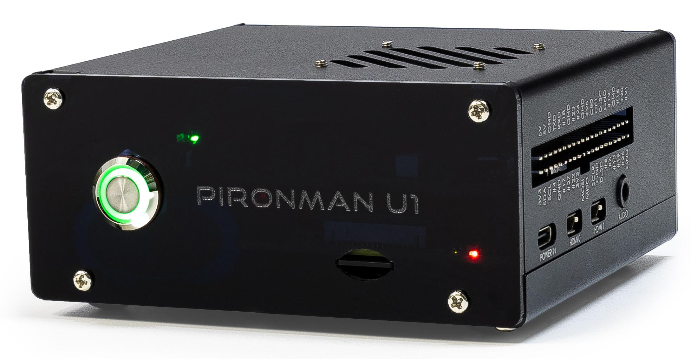

Pironman U1: Advanced UPS and Cooling System for Raspberry Pi
================================================================================

Thanks for choosing our Pironman U1.

.. .. note::
..     This document is available in the following languages.

..         * |link_german_tutorials|
..         * |link_jp_tutorials|
..         * |link_en_tutorials|
    
..     Please click on the respective links to access the document in your preferred language.

The Pironman U1 is a versatile UPS enclosure for Raspberry Pi, designed to ensure uninterrupted power and data protection. It features a robust UPS system to safeguard against sudden power losses, and an efficient cooling system with a heat sink and fan to maintain optimal performance. The Pironman U1 intelligently manages power, seamlessly switching to battery in case of low external voltage and smartly adjusting charging currents. It supports NVMe SSD expansion, especially beneficial for Pi 5 users, and includes an infrared receiver for multimedia control. With a 7.4V 2000mAh battery, it provides 2-5 hours of backup power, making it an indispensable accessory for Raspberry Pi enthusiasts.

If you have any questions, please send an email to service@sunfounder.com and we will respond as soon as possible.

.. raw:: html

    

.. toctree::
    :maxdepth: 2

    About this Kit <self>
    what_do_we_need    
    assembly_instructions
    pi_start/installing_the_os
    pi_start/set_up_your_raspberry_pi
    quick_user_guide
    hardware/about_hardware
    home_assistant/home_assistant
    appendix/appendix

**Copyright Notice**

All contents including but not limited to texts, images, and code in this manual are owned by the SunFounder Company. You should only use it for personal study,investigation, enjoyment, or other non-commercial or nonprofit purposes, under therelated regulations and copyrights laws, without infringing the legal rights of the author and relevant right holders. For any individual or organization that uses these for commercial profit without permission, the Company reserves the right to take legal action.

